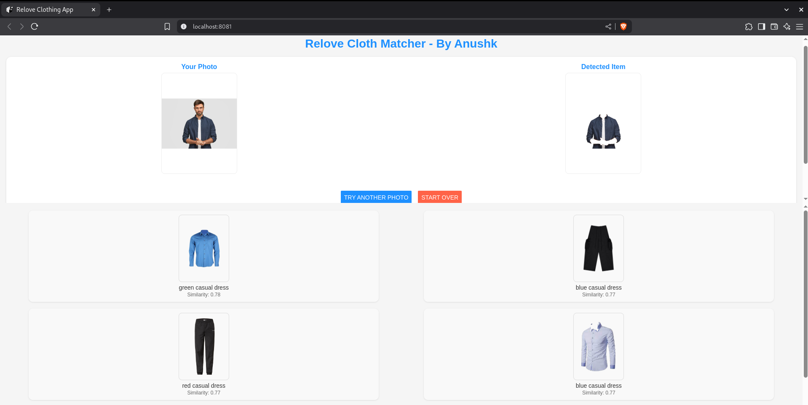
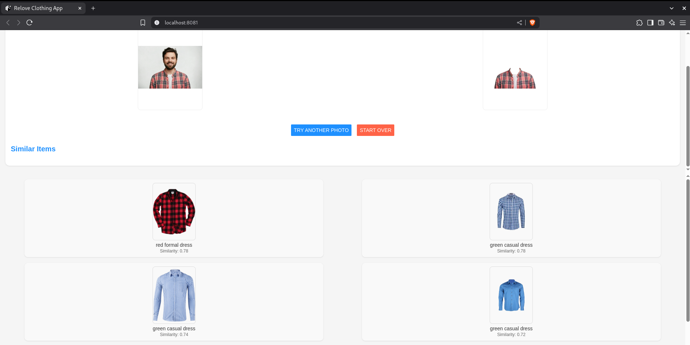
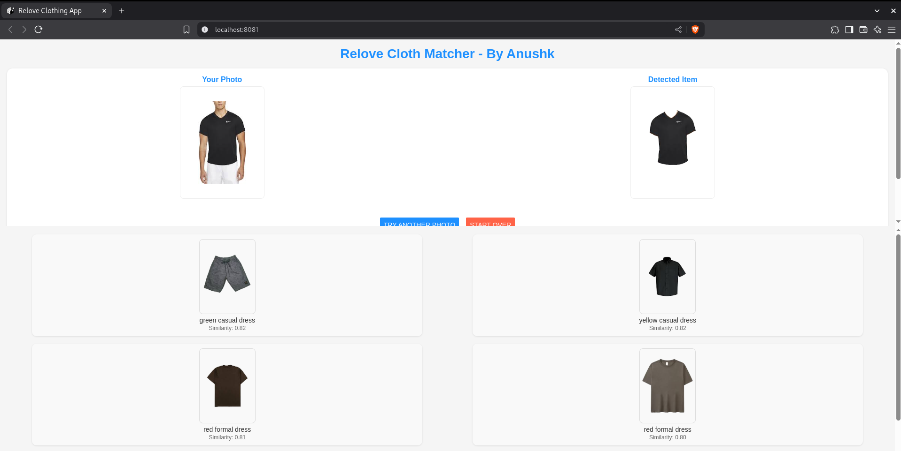
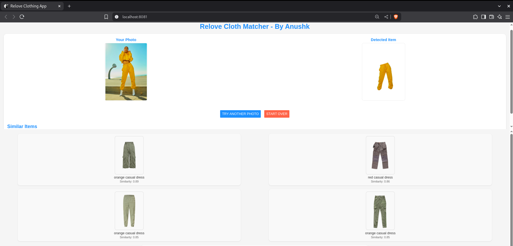

# GarmentRx
A React Native application powered by an AI/ML pipeline that recommends similar clothing items. Upload a photo, segment the garment using U2-Net, and get matched suggestions from a MongoDB Atlas database.

## Features
- Upload and segment clothing items using the U2-Net model.
- Display matched garments with color, style, and similarity scores.
- Optional image cropping for better segmentation.
- Responsive UI with preview and reset options.

## Tech Stack
- Frontend: React Native (Expo)
- Backend: Node.js (Express)
- AI/ML: Python (U2-Net segmentation, ResNet50 feature extraction, matching)
- Database: MongoDB Atlas
- Dependencies: expo, axios, expo-image-manipulator, express, multer

## Prerequisites
- **Node.js**: 18.x or later
- **npm**: 9.x or later
- **Python 3.9+**: For AI/ML scripts
- **Expo CLI**: Install with `npm install -g expo-cli`
- **Git**: 2.x or later
- **MongoDB Atlas**: Sign up at [mongodb.com/cloud/atlas](https://www.mongodb.com/cloud/atlas)
- **Android Device**: For Expo Go testing

## AI/ML Pipeline Overview
The application leverages a sophisticated AI/ML pipeline to process and recommend clothing items:

1. **Image Upload**: Users upload a photo via the React Native frontend, which sends it to the backend.
2. **Segmentation with U2-Net**: The U2-Net model, a deep learning architecture designed for salient object detection, isolates the garment from the background. U2-Net’s nested U-structure with multiple side outputs enhances accuracy, making it ideal for precise clothing segmentation even in complex images.
3. **Feature Extraction**: ResNet50 extracts deep features, while HSV color space analysis adds color attributes, creating a rich feature vector for each garment.
4. **Matching**: The pipeline compares the extracted features against a MongoDB Atlas database (~10 dresses) using a similarity metric, returning the top matches with metadata (color, style, similarity score).
5. **Result Display**: The frontend renders the segmented image and matched items.

This pipeline, driven by Python scripts (`segment.py`, `extract.py`, `match.py`), runs on the backend, with results stored temporarily in the `output/` directory.

## Setup

1. **Clone the Repository**
   ```bash
   git clone <repo-url>
   cd GarmentRx


2. **Install Backend Dependencies**
    ```bash
    cd server
    npm install

3. **Install Frontend Dependencies** 
    ```bash
    cd ../app
    npm install

4. **Set Up Cloth Segmentation/Recommendation Pipeline**
    ```bash
    pip install -r ../requirements.txt

5. **Run the Application**

* Backend
    ```bash
    cd ../server 
    node app.js

* Frontend
    ```bash
    cd ../app
    npx expo start --clear

**Scan the QR code with Expo Go on your Android device** 
or
**Head towards http://localhost:8081/ on Web**

6. **Test**
    * Upload test_data/test_img_2.jpg and verify segmented and matched results.

## App-Screenshots




## Contributing
Feel free to fork, enhance, or report issues.
